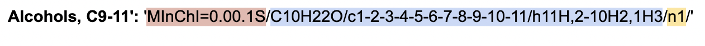
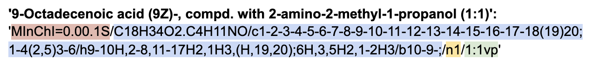
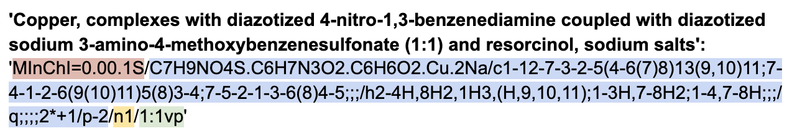

## Cheminformatics of Unknown, Variable, Complex, and Biological (UVCB) substances

Unknown, Variable, Complex, and Biological (UVCB) substances are quite prevalent in our environment, but FINISH THIS SENTENCE ADD TWO MORE SENTENCES. Thus, this article describes how to standardize these unknown substances into a machine-readable format developed Clark et. al., called the Mixtures InChI (MInChI) string.  

## Research Questions

Here are the motivating research questions of this project:

1. To what extent can UVCBs (mixtures) be encoded in machine-readable formats i.e., as MInChIs?
2. What challenges exist in encoding MInChIs using currently available UVCB data? 
3. How can UVCB data providers improve the communication and dissemination of UVCB compounds?

Throughout this article, these research questions will be addressed as we walk through the Python code written to generate the MInChI strings. 

## Installing and Running Mixtures Github

It is useful to begin this project by understanding the work done by Clark et. al. In particular, running their [Github repository](https://github.com/cdd/mixtures) generates several Mixfiles that can be analyze and viewed using the Electron app. When installing Clark et. al.’s mixtures project, if you encounter an error when running the command electron app, try these commands instead:

```markdown
cd app
./node_modules/.bin/electron .
```

## Parsing the Data

The UVCB data was collected and compiled by Dr. Wang, separated into files according to their SOMETHING. The “EU_REACH” file came from FINISH THIS SENTENCE. The “mixtures” file SOMETHING, while the “random” file SOMETHING FINISH THIS SENTENCE.

In each row of the file, there are 150 UVCB substances. The columns correspond to different chemical characteristics of the substance. Of the 53 columns called `chem_keys`, the columns needed to generate the Mixfile and MInChI are “Chemical_Name_Final”, “InChIKey_Final”, “InChI_Final”, and “SMILES_Final”. Although the remaining 49 column entries are not needed, they will still be extracted from the file.

```markdown
with open (filepath, 'r') as infile:
    lines = infile.readlines()
    chem_keys =  lines[0].split('\t')
```

The entire file is parsed into a list of dictionaries called `chem_dict`, with each list entry corresponding to a dictionary of keys and values for a given UVCB substance.

```markdown
chem_dict = []
for i in range(1, len(lines)): #want to skip the first row of labels
    current_dict = {}
    for k in range(len(chem_keys)):
        current_dict[chem_keys[k]] = lines[i].split('\t')[k]
 
    chem_dict.append(current_dict)
```

For example, the second row in the “EU_REACH” file would be represented as a dictionary where:

```markdown
current_dict = {
        “ID” : "149363"
        “CAS_No” : "66455-17-2"
        “Chemical_Name” : "Alcohols, C9-11"
        _and so on…_
        }

```

In case this list of dictionaries needs to be accessed later on for a different project, `chem_dict` will be saved as a JSON file.

## Extracting Relevant Keys

As mentioned previously, “Chemical_Name_Final”, “InChIKey_Final”, “InChI_Final”, and “SMILES_Final” are the keys needed to generate the Mixfile and MInChI for each substance. As described by Clark et. al., a key component of the MInChI string is the structure identifier, or the InChI. Before extracting these four keys, let’s filter `chem_dict` to include only the entries that have an InChI value. These substances will be stored in `filter_InChI`.

```markdown
for i in range(len(chem_dict)):
    if len(chem_dict[i]['InChI_Final']) > 0:
        filter_InChI.append(chem_dict[i])

```

Next, the four keys needed to create the Mixfile and MInChI for each substance can be stored in separate lists.

```markdown

for i in range(len(filter_InChI)):
    names.append(filter_InChI[i]['Chemical_Name_Final'])
    InChI_list.append(filter_InChI[i]['InChI_Final'])
    InChI_key_list.append(filter_InChI[i]['InChIKey_Final'])
    SMILES_list.append(filter_InChI[i]['SMILES_Final'])

```

These four lists will be needed later on.

## Generating the Molfile

One of the components of a substance’s Mixfile is its corresponding Molfile. To generate the Molfile, the `Chem` module from an opensource cheminformatics library called `rdkit` is used to convert the substance’s SMILES value to its Molfile. Each molfile is stored in `molfile_list`.

```markdown
for i in range(len(SMILES_list)):
    m = Chem.MolFromSmiles(SMILES_list[i])
    molfile_string = Chem.MolToMolBlock(m)
    molfile_list.append(molfile_string)
```

## Finding Substance Concentrations

In Clark et. al.’s paper, they describe the different ways a chemical structure can be quantified (%, mol/L, w/v%, etc.). However, one limitation of this data is that there is no column that specifies the quantity of the substance and its corresponding units. The only indication of a quantity came from a few of the chemical names that contained a ratio concentration, such as (1:1) or (1:2). These values were extracted and stored in `quantities`. The MInChI format denotes ratio concentration with “vp” units.

```markdown
for n in range(len(names)):
    name = names[n]
    for l in range(len(name)):
        if name[l] == '(':
            if name[l+2] == ':' and name[l+4] == ')':
                quantities[n] = name[l:l+5]
                units[n] = 'vp' #MInChI units for ratio
```

## Creating the Mixfile

The next step is to create a Mixfile for each substance, which is formatted in JSON. Each Mixfile contains the Mixfile version, chemical name, Molfile, InChI, InChI key, SMILES, and concentration ratio if it exists. 

```markdown
for i in range(len(InChI_list)):
    mixfile_dict = {}
    mixfile_dict['mixfileVersion'] = 0.01
    mixfile_dict['name'] = names[i]
    mixfile_dict['molfile'] = molfiles[i]
    mixfile_dict['inchi'] = InChI_list[i]
    mixfile_dict['inchiKey'] = InChI_key_list[i]
    mixfile_dict['smiles'] = SMILES[i]
    if len(quantities[i]) > 0:
        ratio = '[' + str(quantities[i][1]) + ', ' + str(quantities[i][3] + ']')
        mixfile_dict['ratio'] = ratio
 
    with open('mixfiles/' + filename + '_mixture' + str(i) + '.mixfile', 'w') as outfile:
        json.dump(mixfile_dict, outfile)
```

As shown from the code above, only one dictionary is created for the entire Mixfile, even though there are multiple components that make up each UVCB substance. A major challenge of creating Mixfiles from this data has to do with the fact that the components of a mixture cannot be identified. The InChI values, for example, don’t contain the “&” symbol, which denotes separate components.

Ideally, there would be an InChI, InChI key, and SMILES for each component of the mixture. However, the dataset only contains, at most, one InChI, one InChI key, and one SMILES for each mixture. Thus, the corresponding MInChI string will only contain one index. 

## Generating the MInChI String

The most important step of this project is to generate the MInChI strings! We have collected all the pieces and now they can be assembled. As mentioned earlier, because there is only one component in each Mixfile, it is relatively straightforward to generate the MInChI. Clark et. al. provide a traversal algorithm, which would be used if these mixtures had more than one component. 

```markdown
for mixfile in mixfiles:
    header = 'MInChI=0.00.1S'
    identifier = mixfile['inchi'][9:]
    indexing = 'n1'
    concentration = ''
    if 'ratio' in mixfile.keys():
        concentration = mixfile['ratio'][1] + ':' + mixfile['ratio'][3] + 'vp'
 
    minchi = header + '/' + identifier + '/' + indexing + '/' + concentration
    minchis[mixfile['name']] = minchi
```

Each MInChI string is separated into four parts: the header, structure identifier, indexing, and concentration. All of the strings are stored in a dictionary called `minchis`, with each key corresponding to the name of the substance.

## Analyzing MInChI Strings

Here are a few examples of the MInChI strings that were generated from the EU_REACH dataset. All MInChI strings have the same header: MInChI=0.00.1S.

Example #1:


**Structure identifier:** C10H22O/c1-2-3-4-5-6-7-8-9-10-11/h11H,2-10H2,1H3 → in this case, there is only one InChI associated with Alcohols, C9-11

**Indexing:** n1 → since there is only one component, there is only one index

**Concentration:** there is no concentration associated with this mixture

Example #2:


**Structure identifier:** C18H34O2.C4H11NO/c1-2-3-4-5-6-7-8-9-10-11-12-13-14-15-16-17-18(19)20;1-4(2,5)3-6/h9-10H,2-8,11-17H2,1H3,(H,19,20);6H,3,5H2,1-2H3/b10-9-; → it would be better if there were two separate InChI;s for 9-Octadecenoic acid (9Z) and 2-amino-2-methyl-1-propanol (1:1), respectively

**Indexing:** n1 → if there were two components, the indexing would be n{1&2} 

**Concentration:** 1:1vp → this is the concentration ratio of the entire mixture

Example #3:


**Structure identifier:** C7H9NO4S.C6H7N3O2.C6H6O2.Cu.2Na/c1-12-7-3-2-5(4-6(7)8)13(9,10)11;7-4-1-2-6(9(10)11)5(8)3-4;7-5-2-1-3-6(8)4-5;;;/h2-4H,8H2,1H3,(H,9,10,11);1-3H,7-8H2;1-4,7-8H;;;/q;;;;2*+1/p-2 → it would be better if the structure identifier was separated into multiple components

**Indexing:** n1 → there should ideally be multiple components with a larger index

**Concentration:** 1:1vp → in this case, the (1:1) ratio corresponds to a portion of the mixture, but does not include resorcinol, sodium salts. This could be misleading if someone assumes the 1:1vp corresponds to the entire mixture


## Finalizing MInChI Data

Once the MInChI strings are generated, they can be integrated back into the original datasets. A new column called “MInChI” will contain the strings that were generated for several mixtures in the datasets.

```markdown

outfile = open(filename + '_MInChI.txt', 'w')

chem_keys[-1] = 'Iodo'
chem_keys.append('MInChI\n')
outfile.write('\t'.join(chem_keys))
 
for i in range(len(chem_dict)):
    name = chem_dict[i]['Chemical_Name_Final']
    elts = list(chem_dict[i].values())
    elts[-1] = elts[-1].strip('\n')
    if name in minchis:
        elts.append(minchis[name])
    else:
        elts.append('')
 
    outfile.write('\t'.join(elts) + '\n')

```

## Summary Statistics and Conclusion

Summary statistics can be computed in order to better understand the data available to use in these three UVCB files. Here are some notable observations:

|                                                                       | EU_REACH                     | mixtures                   | random                   |
|-----------------------------------------------------------------------|------------------------------|----------------------------|--------------------------|
| Number of substances that have a MInChI (out of 150 total substances) | 26 (17.3% of all substances) | 36 (24% of all substances) | 6 (4% of all substances) |
| Number of substances with InChI, SMILES, and concentration ratio      | 6                            | 25                         | 0                        |
| Number of substances with only InChI and SMILES                       | 20                           | 9                          | 6                        |


Out of the three files, the most MInChIs were generated from the “mixture” UVCB data. There were also significantly more substances in the “mixtures” data that indicated a concentration ratio. Nevertheless, it’s evident that most mixtures are lacking the minimum information needed (the InChI) to encode the MInChI string. Also, SOMETHING ABOUT NOT BEING SEPARATED BY COMPONENTS

## Welcome to GitHub Pages

You can use the [editor on GitHub](https://github.com/ninasachdev/UVCB-MInChI/edit/gh-pages/README.md) to maintain and preview the content for your website in Markdown files.

Whenever you commit to this repository, GitHub Pages will run [Jekyll](https://jekyllrb.com/) to rebuild the pages in your site, from the content in your Markdown files.

### Markdown

Markdown is a lightweight and easy-to-use syntax for styling your writing. It includes conventions for

```markdown
Syntax highlighted code block

# Header 1
## Header 2
### Header 3

- Bulleted
- List

1. Numbered
2. List

**Bold** and _Italic_ and `Code` text

[Link](url) and 
```

For more details see [GitHub Flavored Markdown](https://guides.github.com/features/mastering-markdown/).

### Jekyll Themes

Your Pages site will use the layout and styles from the Jekyll theme you have selected in your [repository settings](https://github.com/ninasachdev/UVCB-MInChI/settings). The name of this theme is saved in the Jekyll `_config.yml` configuration file.

### Support or Contact

Having trouble with Pages? Check out our [documentation](https://docs.github.com/categories/github-pages-basics/) or [contact support](https://support.github.com/contact) and we’ll help you sort it out.
